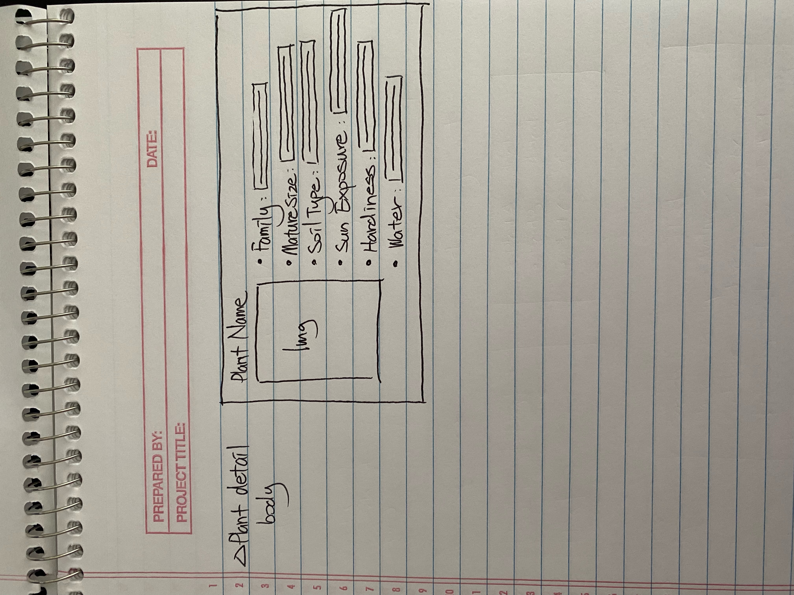

# Project Planning
For this assignment, you'll create some initial plans for your project.

## Assignment Description
[Project Planning Assignment](https://education.launchcode.org/liftoff/modules/assignments/project-planning)

## Submission Instructions

### Wireframes

### Project Tracker

Include a link to your public Trello board. Be sure you have user stories added for at least your first 2-week sprint.

### Project Repo Link

Include a link to your project on GitHub.
